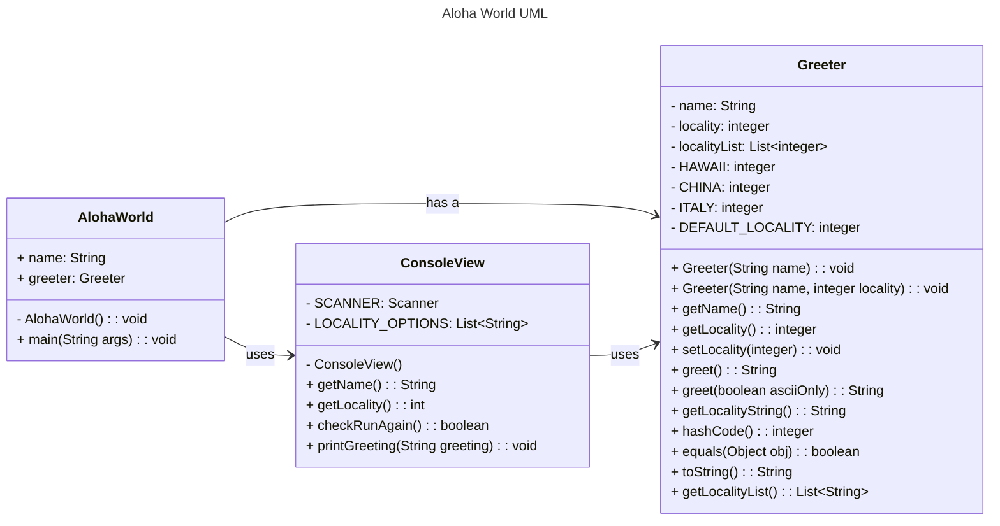

# Homework Aloha World Report

The following report contains questions you need to answer as part of your submission for the homework assignment. 

## Design Doc
Please link your UML design file here. See resources in the assignment on how to
link an image in markdown. You may also use [mermaid] class diagrams if you prefer, if so, include the mermaid code here.  You DO NOT have to include Greeting.java as part of the diagram, just the AlohaWorld application that includes: [AlohaWorld.java], [Greeter.java], and [ConsoleView.java].

### Program Flow
Write a short paragraph detailing the flow of the program in your own words. This is to help you understand / trace the code (and give you practice of something called a code walk that will be required in this course).

The program execution begins in the only public Class `AlohaWorld` in its  function `main`. 

In `main` the following things happen.

One instance each of the classes String as `name` and int as `locality` is created.

`main` calls methods from the class `ConsoleView`: `ConsoleView.getName()` to get the user input string for `name`, and  `ConsoleView.getLocality()` to get int `locality`.

Based on these an object `greeter` of the class `Greeter` is created. This object has the following features: a `String name`, an `int location`, and a `listLocations<String>` which matches a uniques String `greeting` to the object using `location` as the index for the `listLocations`.

Finally `main` sends this object, `greeter`, over to the function `ConsoleView.printGreeting(greeter)` where a formatted string with user entered `name` and the matching `greeting` can be sent to the standard output stream to be displayed on the terminal.

The execution then return to `main` where a while loop is initiated to asks user if they want to exit or continue using `ConsoleView.checkRunAgain()`. If the user chooses to continue `yes` or `y`, the local memory of object `greeter` is deleted and a new object of the same name is created and the process descibed in above two paragraphs is repeated. If the user chooses to exit, `no` or `n`, the execution returns to main.

In `main` while loop is terminated, and ultimately `main` and the program are terminated.

## Assignment Questions

1. List three additional java syntax items you didn't know when reading the code.  (make sure to use * for the list items, see example below, the backtick marks are used to write code inline with markdown)
   
   * (example) `final class`
   * `package`
   * `Integer.parseInt`
   * `String.equals`

2. For each syntax additional item listed above, explain what it does in your own words and then link a resource where you figured out what it does in the references section. 

    * (example) The `final` keyword when used on a class prevents the class from being subclassed. This means that the class cannot be extended by another class. This is useful when you want to prevent a class from being modified or extended[^1] . It is often the standard to do this when a class only contains static methods such as driver or utility classes. Math in Java is an example of a final class[^2] .
    * `package` whether user defined on imported, programs can be structured into collections of packages, with each package maintaining its own set of type names, helping to avoid naming conflicts[^3].
    * `Integer.parseInt` converts strings to integers if the characters match integer format[^4].
    * `String.equals` Compares a string to another specified object, the result is true if and only if both match character by character[^5].

3. What does `main` do in Java? 

    Go ahead and answer the question as a short paragraph / few sentences. Notice the indent, this is valid because it is a list item. (erase this line before writing.)

    `main` method is the entry point of a program in Java. Java compiler expects one (and only one) main in one (and only one) public class.

4. What does `toString()` do in Java? Why should any object class you create have a `toString()` method?

    `toString()` formats information stored in any class for human viewing as a string. If an object class has some salient information that can be viewed by humans as a string, the designer/writer should ensure the only the pertinent information is displayed when the user asks to print the instances (objects) of the class. 

5. What is javadoc style commenting? What is it used for? 

    Javadoc style comments are specific long comments that can be parsed and compiled into HTML java docs by `javadoc` tool. One can pass critical information as elements such as parameters as @params, and return as @return, and the `javadoc` can create preformmated clean documentation.

6. Describe Test Driving Development (TDD) in your own words. 

    Test Diving Development is a paradigm where before writing functions, we create tests based on how the function will work as a black-box, what will go in and what will come out. Especially for the edge cases. This way the functions can be tested as soon as they are written.  

7. Go to the [Markdown Playground](MarkdownPlayground.md) and add at least 3 different markdown elements you learned about by reading the markdown resources listed in the document. Additionally you need to add a mermaid class diagram (of your choice does not have to follow the assignment. However, if you did use mermaid for the assignment, you can just copy that there). Add the elements into the markdown file, so that the formatting changes are reserved to that file. 

    Done.

## Deeper Thinking Questions

These questions require deeper thinking of the topic. We don't expect 100% correct answers, but we encourage you to think deeply and come up with a reasonable answer. 

1. Why would we want to keep interaction with the client contained to ConsoleView?

    To control scope for safety. Limiting client interactions to a program creates boundary of what clients can change. They cannot access private variables defined elsewhere.

2. Right now, the application isn't very dynamic in that it can be difficult to add new languages and greetings without modifying the code every time. Just thinking programmatically,  how could you make the application more dynamic? You are free to reference Geeting.java and how that could be used in your design.

    We created the class `Greeting` as a part of the assignment. We could use this class to let a user or administrator create the `listLocality` and corresponding new lists `listAsciiGreeting` and `listUnicodeGreeting`. 
    
    We will also need to update the method `Greeter.greet()` to `switch` by `int` `locality` (`localityID` in `Greeting`) to find the correct corresponding Strings `greeting` and then `formatStr` for display.

> [!IMPORTANT]
>  After you upload the files to your github (ideally you have been committing throughout this progress / after you answer every question) - make sure to look at your completed assignment on github/in the browser! You can make sure images are showing up/formatting is correct, etc. The TAs will actually look at your assignment on github, so it is important that it is formatted correctly.

## References

[^1]: Final keyword in Java: 2024. https://www.geeksforgeeks.org/final-keyword-in-java/. Accessed: 2024-03-30. 

[^2]: Math (Java Platform SE 17). https://docs.oracle.com/en/java/javase/17/docs/api/java.base/java/lang/Math.html. Accessed: 2024-03-30.

[^3]: Packages (Java Platform SE 8). https://docs.oracle.com/javase/specs/jls/se8/html/jls-7.html#jls-7.4. Accessed: 2026-01-17.

[^4]: Integer.parseInt (Java Platform SE 8). https://docs.oracle.com/javase/8/docs/api/java/lang/Integer.html#parseInt-java.lang.String-

[^5]: String.equals (Java Platform SE 8). https://docs.oracle.com/javase/8/docs/api/java/lang/String.html#equals-java.lang.Object-

<!-- This is a comment, below this link the links in the document are placed here to make ti easier to read. This is an optional style for markdown, and often as a student you will include the links inline. for example [mermaid](https://mermaid.js.org/intro/syntax-reference.html) -->
[mermaid]: https://mermaid.js.org/intro/syntax-reference.html
[AlohaWorld.java]: src/main/java/student/AlohaWorld.java
[Greeter.java]: src/main/java/student/Greeter.java
[ConsoleView.java]: src/main/java/student/ConsoleView.java